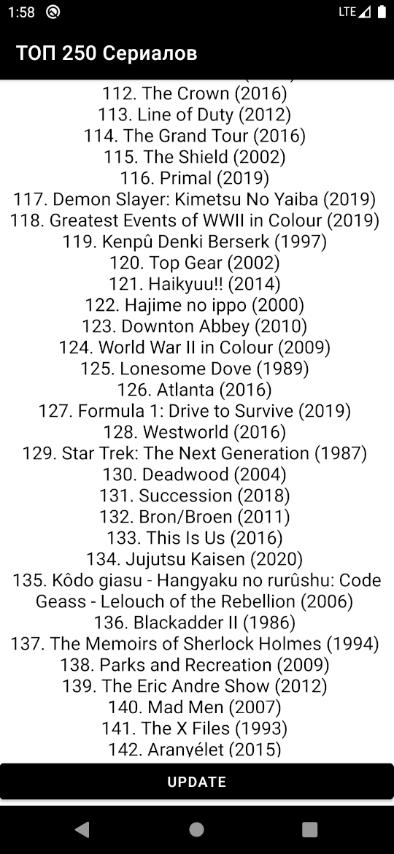

# BMK01_JSOUP
## Разработка программ для мобильных устройств
Парсинг данных с web-страницы с помощью технологии JSOUP для работы с HTML  
https://www.imdb.com/chart/top/?ref_=nv_mv_250
### Лабораторная работа №8
## ТОП 250 Сериалов в приложении

## ТОП 250 Сериалов на официальном сайте IMDb


## Дерево сайта


```
public static String getShowsData() {
        StringBuilder data = new StringBuilder();
        try {
            Document doc = Jsoup.connect(BASE_URL).timeout(5000).get(); // Создание документа JSOUP из html
            data.append("IMDb Top 250:\n");
            data.append(String.format("%12s\n", "Сериалы").trim());
            data.append("\n");
            Elements e = doc.select("div.lister"); // Ищу в документе "<div class="lister"> с данными о шоу
            Elements tables = e.select("table.chart"); // Ищу таблицу, которая принадлежит классу "chart"
            Element table = tables.get(0); // Выибраю 1 таблицу
            Elements tbodies = table.select("tbody.lister-list"); // Ищу тело таблицы, которое принадлежит классу "lister-list"
            Element tbody = tbodies.get(0); // Выибраю 1 тело таблицы
            for (Element row : tbody.select("tr")) {
                // Цикл по столбцам таблицы
                Elements td = row.select("td");
                Element tdTitle = td.get(1); // Выбираю 2 столбец с названием шоу
                data.append(tdTitle.text()).append("\n");
            }
        } catch (Exception ignored) {
            return null; // При ошибке доступа возвращаем null
        }
        return data.toString().trim(); // Возвращаем результат
    }

```
